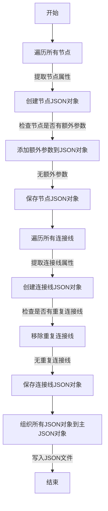

```mermaid
graph TD
    A[开始] --> B[遍历所有节点]
    B -->|提取节点属性| C[创建节点JSON对象]
    C -->|检查节点是否有额外参数| D[添加额外参数到JSON对象]
    D -->|无额外参数| E[保存节点JSON对象]
    E --> F[遍历所有连接线]
    F -->|提取连接线属性| G[创建连接线JSON对象]
    G -->|检查是否有重复连接线| H[移除重复连接线]
    H -->|无重复连接线| I[保存连接线JSON对象]
    I --> J[组织所有JSON对象到主JSON对象]
    J -->|写入JSON文件| K[结束]

  
```